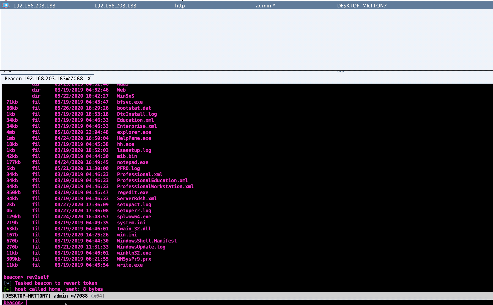

# SpoolSystem

SpoolSystem is a CNA script for Cobalt Strike which uses the Print Spooler named pipe impersonation trick to gain SYSTEM privileges.

It uses internal Cobalt Strike APIs not usually exposed to aggressor scripting to achieve seamless execution as SYSTEM without creating any new process or relying on shellcode injection.

## Running

The script supports two modes:

* inject: this is the one you probably want to use. It triggers the spoolss RPC method via self-injection within the current process. This is the best option for OPSEC, but ideally should be done in a process you don't mind crashing (just incase).
* spawn: this uses `bdllspawn` to trigger the spoolss RPC method, so launches another process (not as good for OPSEC)

Both modes allow a user with only `SeImpersonatePrivilege` to gain SYSTEM privileges within the current beacon session. This is useful if you have a privilege escalation that gives you `LOCAL SERVICE`, `NETWORK SERVICE` or similar. However it can also be used as a straight replacement for `getsystem`, which is much stealthier than the builtin CS method.

## Example

## References

* https://github.com/itm4n/PrintSpoofer